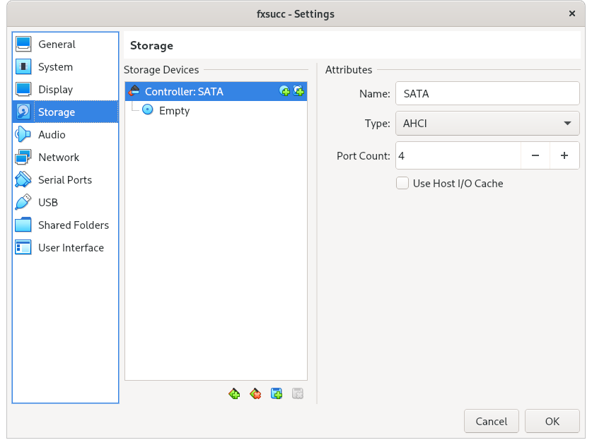
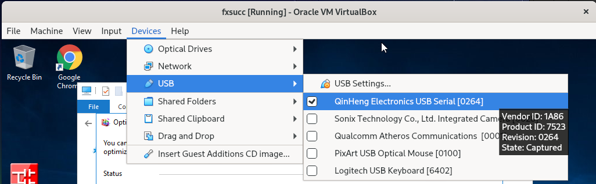
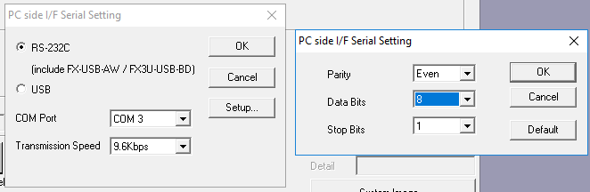
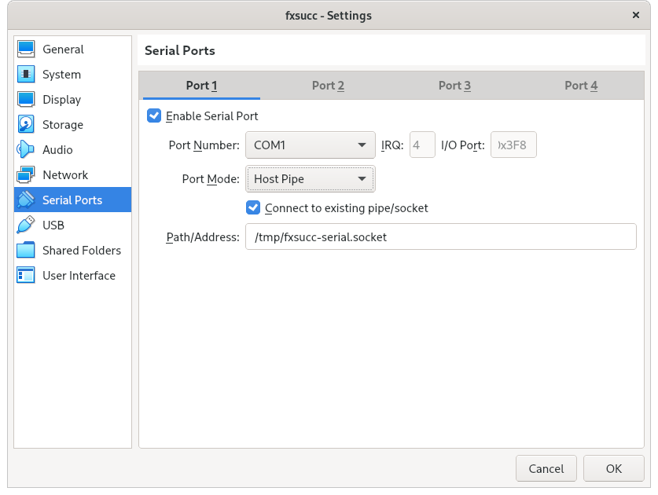
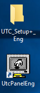
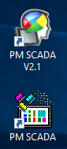

# Manual for Sawmill Machine Programming Toolkit
*Rev. 0 (2021-06-20)*

* \<David Timber\> mieabby@gmail.com

This manual shows how you can use this toolkit to program machines at the mill.
With this manual, you can ...

* Backup and restore PLC programs of Mitsubishi Electric FX series PLCs
* Backup and restore PLC programs of UTSD-105 on CFS-100
* Backup and restore software of GT056 on CFS-100

The OEM programs required to program machines is installed on a **virtual
machine(VM)** to prolong the longevity of the toolkit as some of the OEM
programs were already left unmaintained for a long time(some of which predates
Windows XP). It is speculated that it will become hard to procure an old version
of Windows because Microsoft will break binary compatibility in near future.

To use this toolkit, you need to set up the VM on your PC or laptop. Then you'll
be able to use the cables included in the toolkit for interfacing with PLCs and
HMIs.

The purpose of this manual is to provide information to someone with enough tech
background in a concise manner. If you have difficulties understanding this
manual, please seek advice from someone with adequate tech knowledge.

The document tries to describe how to do things in both GUI and CUI since
changes in GUI components might occur in the future. If you can work out the GUI
part, you can effectively ignore the CUI part.

## Preparation
### Install VirtualBox
Pick a PC or a laptop(preferrably) to program PLCs with. Install VirtualBox on
it. You can download it from the website(https://www.virtualbox.org/) or use the
installation package on DVD "A" at `/dl/vbox`.

After installation, install the Guest Extension. You can download it from the
website. It is also included in the DVD "A". You may run the file or use the
command below.

```sh
vboxmanage extpack install <file>
```

If you're using Unix, do other proper set ups for permissions. For example, your
user has to be in the "vboxusers" group in order to use the host USB devices for
the VM. Also, if you're using a Redhat or Debian family distro, it might be
convenient to add your user to the "dialout" group so that you can access serial
devices without using `sudo` or changing permission of serial devices.

### Import VM
Make a directory named "fxsucc" for the VM. Preferrably where VirtualBox keeps
its VMs.

On Windows:
```bat
mkdir "%HOMEPATH%\VirtualBox VMs\fxsucc"
```

On Unix:
```sh
mkdir "~/VirtualBox VMs/fxsucc"
```

Insert the DVD "B". Copy `/fxsucc.vbox` and `/fxsucc.nvram` to the directory.

To fit the VM image in the DVD, the VM had to be exported using an untraditional
method. The image is compressed using XZ with extreme parameters. It has to be
uncompressed onto the local drive before it can be attached to the VM.

On Windows, use 7z. You can download it from the
website(https://www.7-zip.org/download.html). It's included on DVD "A" at
`/dl/7z`. Uncompress the image by righting click on `/fxsucc-root.vdi.xz` and
then left clicking 7-Zip - Open archive. Extract the image to the directory you
made for the VM.

On Unix, use xz. Install xz using the package manager if it's not installed.

``` sh
# Assume wd is DVD root
xz -vvdkc "./fxsucc-root.vdi.xz" > "~/VirtualBox VMs/fxsucc/fxsucc-root.vdi"
```

Open the .vbox file with VirtualBox. If you're using GUI, you can do so by
simply opening the file. On Unix, use `vboxmanage` command.

```sh
vboxmanage registervm "~/VirtualBox VMs/fxsucc/fxsucc.vbox"
```

Attach the image to the VM. If you're using GUI, go to Storage in the VM
settings. Click on the hard disk icon and add the extracted image.
Alternatively, you can use `vboxmanage`.



```sh
vboxmanage storageattach fxsucc\
    --storagectl SATA\
    --type hdd\
    --medium "~/VirtualBox VMs/fxsucc/fxsucc-root.vdi"
```

Now you can start the VM.

### (Optional)Taking Snapshot of VM
Before starting the VM, it's a good idea to take a snapshot so the original VM
image is preserved. Use the GUI or `vboxmanage` command.

```sh
vboxmanage snapshot fxsucc take original
```

When something goes wrong, simply run following to restore the VM to the
originally imported state.
```sh
vboxmanage snapshot fxsucc restore original
```

You can always use the compressed image on the DVD, but using snapshots is
faster.

## General Information on Using VM
### Redirecting USB Devices
When a USB device is connected, the host takes the control of the device by
default. You can transfer the control over to the VM by following.



```sh
# List USB
vboxmanage list usbhost
# Attach USB to the VM
vboxmanage controlvm fxsucc usbattach <UUID>
```

### Finding COM Ports
COM port assignment on Windows is rather random so you have to figure out which
port is assigned to the serial device that has been plugged in. You can use the
device manager for this.


### Windows on VM
A genuine copy of Windows Server 2016 is installed on the VM. Avoid using the VM
on multiple PCs as it is a copyright violation. If the VM has to be used on
multiple PCs, ensure that the VM is not connected to the internet(the VM's
network interface is disabled out of the box for this reason). Windows checks
the validity of the licence of its copy by connecting to the Microsoft servers
online. If the licence of the VM is deemed invalid by the server, the Windows
installed on the VM will complain about the invalid license causing some minor
inconvenience.

**DO NOT** perform Windows update. The Windows update service and auto update
settings are disabled to prevent accidental update. The VM environment is set up
so that the OEM programs included on the VM can be used in the far future. Doing
Windows Update can lead to broken binary compatibility, defeating the purpose of
having a VM. For the same reason, it is discouraged to connect the VM to the
internet.

## Mitsubishi Electric
On the VM is installed **GX Works 2**, a software package developed by the same
company for programming its PLC products. The price of the package is over
$2,000 so a trial version is installed. Using the trial version comes with a few
drawbacks.

* "InstallDate" registry value has to be reset to the current date before
  launching the program
* The number of steps in PLC programs **may be** limited to 1000 steps

To launch the program, reset the installation date by using "**RESET TRIAL**" on
the desktop. Running it will reset the registry values. Then run "**GX
Works2**". You don't have to run "RESET TRIAL" everytime you launch the program
as long as you have reset the registry values in the last 30 days.


### OEM Manual for GX Works 2
[The OEM manual for GX Works2](oem/mitsubishie/sh080787engr.pdf) is included in
the DVD "A" at `/doc/oem/mitsubishie/sh080787engr.pdf`

### Connecting to PLC and Reading Programs
Refer to the page 43 of the OEM manual. The default serial settings is on the
page 124 of [FX COMMUNICATION](oem/mitsubishie/jy992d69901e.pdf)
(`/doc/oem/mitsubishie/jy992d69901e.pdf`). You can set serial settings by
double-clicking the "PLC Module" icon on the connection set up dialog.



The rest is described in the manual. <ins>**Remember to use "Read from
PLC"**<ins>.


### Intercepting Keyword (technical)
If the programs on PLCs are protected by a "keyword", it is possible to
intercept the keyword by intercepting communications between the VM and the PLC
to capture the keyword as described in [46027935.pdf](46027935.pdf). The
software mentioned in the document does not exist anymore, so the alternative
method for use on Linux is as described below.

First, create the "T pipe".

```sh
# Set serial
stty -F /dev/ttyUSB0 raw cs8 parenb -parodd -cstopb 9600
# Create the pipe
socat /dev/ttyUSB0,raw,echo=0 SYSTEM:'tee serial.in |
  socat - "UNIX-LISTEN:/tmp/fxsucc-serial.socket" | tee serial.out'

# Essentially, the last command acts as a T pipe:
#
# Actual Serial Device -> SOCAT -> UNIX Socket (/tmp/fxsucc-serial.socket)
#                           |
#                           V
#                       serial.in
#                       serial.out
```

The VM can use the unix socket created(`/tmp/fxsucc-serial.socket`) for its
serial device. The VM has to be turned off before the pipe can be created.

```sh
vboxmanage modifyvm fxsucc /
    --uart1 0x3F8 4/
    --uartmode1 client "/tmp/fxsucc-serial.socket"
```



When it's all set up, boot up the VM and attempt to read programs from the PLC.
The data containing the keyword should be captured in the file `serial.in`. You
can extract the keyword in the data as described in
[46027935.pdf](46027935.pdf). `hexdump` or `xxd ` command will come in handy.

```sh
hexdump -C "serial.in"
# or
xxd -g1 "serial.in"
```

**NOTE**

* During the VM boot, Windows will print some messages to COM1. You can
  generally ignore it but if you don't want this, you can create 2 serial ports
  (COM1 disconnected, COM2 connected to the pipe) so that data output to COM1 is
  discarded
* Serial settings in the VM won't matter. The VM will capture serial ioctl
  commands and translate the data accordingly

When you're done with the pipe, you must set the settings to the clean slate or
the VM will not start. If you're using GUI, the "clean state" is (in this
order!)

* **Path/Address** set to an empty string
* **Port Mode** set to "Disconnected"
* Then finally, **Enable Serial Port** unchecked.

The serial ports settings is not frequently used feature so there are many loose
ends to it. Using the CUI is way easier in this case.

```sh
vboxmanage modifyvm fxsucc /
    --uart1 off/
    --uartmode1 disconnected
```

## Full Power/Titan
The programmable components of the docking saw are

* HMI(aka "control panel") model GT056-AST2B by Amens
* PLC("motor driver") model UTSD-105-15 by Micro Trend

The components as well as the machine itself are made by small independent
Taiwanese companies. All the materials regarding the components in case the
manufacturers become defunct.

### PLC
**UTC Setup Plus** and **UTC Panel** are the OEM software provided.



The PLC has 2 serial ports. The settings of COM1 is configurable only with the
"DIP-switch" and COM2 is software-controlled. Therefore, COM1 port is best
suited for restoring backup state of the PLC as it is not affected by software.

The default settings of the serial ports can be found ...

* COM1: page 6 of [UtcPanel+ QUICK SETUP
  GUIDE](oem/cfs-100/plc/UTCPanel+_Guide_E.pdf)
  `/doc/oem/cfs-100/plc/UTCPanel+_Guide_E.pdf`)
* COM2: page 44-45 of [UTSD Reference
  Manual](oem/cfs-100/plc/UTSD3.0manual_eng.pdf)
  `/doc/oem/cfs-100/plc/UTSD3.0manual_eng.pdf`)

|             |   COM 1   |  COM 2   |
| ----------- | --------- | -------- |
| **BAUD**    | 38400     | 19200    |
| **DATA**    | 8 bit     | 8 bit    |
| **PARITY**  | none      | none     |
| **STOP**    | 1 bit     | 1 bit    |
| **RTS/CTS** | *enabled* | disabled |

Refer to [UtcPanel+ QUICK SETUP GUIDE](oem/cfs-100/plc/UTCPanel+_Guide_E.pdf)
  (`/doc/oem/cfs-100/plc/UTCPanel+_Guide_E.pdf`) for instructions.

### HMI
This particular model of the HMI is only programmable via the USB type-B port.
You can power the device when programming using the 24V power supply included in
the kit. The device is visible on the host as "**Neo HMI**". You can redirect
this device to the VM and use **PM SCADA 2** on the VM to program the HMI. PM
SCADA 1 is also included.



Refer to [the manual](oem/cfs-100/hmi/pm%20manual_e.pdf) at
`/doc/oem/cfs-100/hmi/pm manual_e.pdf`. Data transfer instructions are on page
156.
Disregard the use of serial port in the manual.

#### NOTE on Device Driver
The device driver won't work via a USB 1.1 link. This is the reason why the
guest extension has to be installed. The driver is located in the following
directory on the VM.

> C:\Program Files (x86)\PM SCADA\V2.1\Usb

#### NOTE on OEM Code
There are multiple manufacturers of the product. The one that's used on the
machine is **GT056** by Amens while the other being **PT056** by Cermate. The
device driver for both products are the same and software from both companies
will recognise both of the model. However, attempting to programming the product
will fail if the "OEM code" of the software does not match with the
hardware(HMI).

Only the software developed by Amens is installed on the VM. If you need to use
Cermate hardware, visit their website to download their software. However, it's
most likely that Amens HMI images won't work on Cermate HMI hardware.

#### Technical NOTE on Password
The HMI image is password protected and the default password is "000000000" or
"111111111". If a password other than these is used, it still might be possible
to intercept the password with USB capture programs like Wireshark. Assumption
is that the SoC used on the product is not powerful enough to implement
encrypted mtdblocks. It is still possible that the protocol is designed in a way
that passwords are not transmitted over the wire. If this is the case, the only
option is to disecting the spi flash chips off the boards to directly interface
with them.
